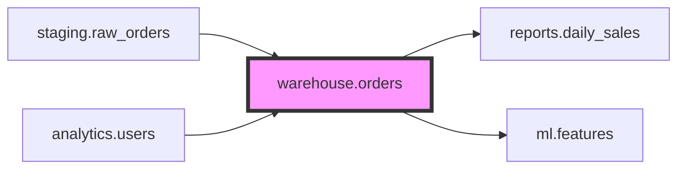
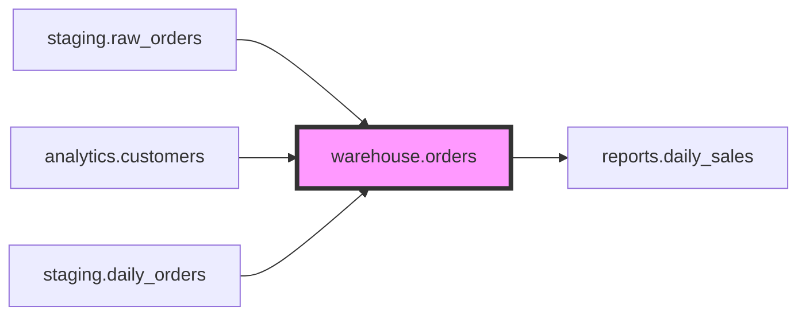

# Usage Examples

Practical examples of using the MCP server with Claude Desktop.

## Example 1: Explore Available Datasets

**Prompt:**
```
Show me all the datasets in our BigQuery project
```

**Claude Response:**
Uses `list_datasets` tool and displays:
```json
{
  "datasets": [
    "analytics",
    "warehouse",
    "staging",
    "logs"
  ]
}
```

## Example 2: Get Table Metadata with Optimization Tips

**Prompt:**
```
I need to query the users table in the analytics dataset.
Show me its schema, partitioning, and clustering information.
```

**Claude Response:**
Uses `get_table_metadata` tool and explains:
- Schema fields and types
- Partition column (e.g., `created_date`)
- Clustering fields (e.g., `user_id`, `country`)
- Whether partition filters are required
- Optimization recommendations

**Output:**
```json
{
  "tableId": "users",
  "datasetId": "analytics",
  "schema": {
    "fields": [
      {"name": "user_id", "type": "STRING", "description": "Unique user identifier"},
      {"name": "created_date", "type": "DATE", "description": "User creation date"},
      {"name": "country", "type": "STRING", "description": "User country"}
    ]
  },
  "partitioning": {
    "type": "DAY",
    "field": "created_date",
    "requirePartitionFilter": true
  },
  "clustering": {
    "fields": ["user_id", "country"]
  }
}
```

## Example 3: Visualize Data Lineage

**Prompt:**
```
Show me the data lineage for the warehouse.orders table
```

**Claude Response:**
Uses `get_data_lineage` tool and displays Mermaid diagram showing:
- Upstream sources (e.g., `staging.raw_orders`, `analytics.users`)
- Downstream consumers (e.g., `reports.daily_sales`, `ml.features`)

**Mermaid Diagram:**


## Example 4: Check Data Quality

**Prompt:**
```
What are the latest data quality results for analytics.users?
```

**Claude Response:**
Uses `get_data_quality_results` tool and summarizes:
- Overall pass/fail status
- Dimension scores (completeness, validity, uniqueness)
- Failed rules
- Recommendations for fixing issues

**Output:**
```json
{
  "scanName": "users_daily_quality_scan",
  "passed": false,
  "executionTime": "2024-01-15T10:30:00Z",
  "dimensions": [
    {
      "dimension": "COMPLETENESS",
      "passed": true,
      "score": 0.98,
      "failedRules": []
    },
    {
      "dimension": "VALIDITY",
      "passed": false,
      "score": 0.87,
      "failedRules": ["email_format_check"]
    }
  ],
  "rowCount": 1500000
}
```

## Example 5: List Tables in Dataset

**Prompt:**
```
Show me all tables in the analytics dataset
```

**Claude Response:**
Uses `list_tables` tool and displays:
```json
{
  "tables": [
    "users",
    "events",
    "sessions",
    "conversions"
  ]
}
```

## Example 6: Understand Table Structure

**Prompt:**
```
I'm new to this project. Can you explain the structure of the warehouse.orders table?
```

**Claude Response:**
Uses `get_table_metadata` tool and provides a comprehensive explanation:
- Table purpose (based on description)
- All columns with types and descriptions
- How the table is partitioned
- How it's clustered for query optimization
- Best practices for querying this table

## Example 7: Check Lineage for Impact Analysis

**Prompt:**
```
I need to modify the staging.raw_orders table. What downstream tables will be affected?
```

**Claude Response:**
Uses `get_data_lineage` tool and:
1. Shows all downstream dependencies
2. Highlights immediate children
3. Warns about potential impact
4. Suggests testing approach

## Example 8: Complete Lineage Visualization

**Prompt:**
```
Show me the complete lineage for warehouse.orders
```

**Claude Response:**
Uses `get_data_lineage` tool and displays:
- Upstream/downstream nodes
- Mermaid diagram visualization
- Process details for each lineage link

**Mermaid Diagram:**


**Response includes:**
```json
{
  "upstream": [...],
  "downstream": [...],
  "links": [...],
  "mermaidDiagram": "..."
}
```

## Tips for Effective Use

### 1. Always Check Metadata First
Before querying, use `get_table_metadata` to understand:
- Partitioning strategy
- Clustering fields
- Required filters

### 2. Leverage Lineage for Impact Analysis
Use `get_data_lineage` to:
- Understand data dependencies
- Assess downstream impact of changes
- Find alternative data sources

### 3. Monitor Data Quality
Regular `get_data_quality_results` checks help:
- Catch data issues early
- Validate ETL pipelines
- Ensure compliance with quality standards

## Common Patterns

### Pattern 1: Data Discovery
```
1. list_datasets
2. list_tables (for dataset of interest)
3. get_table_metadata (for specific tables)
4. get_data_lineage (to understand relationships)
5. get_sql_transformations (to see transformation logic)
```

### Pattern 2: Quality Investigation
```
1. get_data_quality_results (identify issues)
2. get_table_metadata (understand schema)
3. get_data_lineage (trace data source)
```

### Pattern 3: Understanding Data Transformations
```
1. get_sql_transformations (see CTAS and INSERT SQL)
2. get_data_lineage (identify source tables and dependencies)
3. get_table_metadata (verify resulting schema)
```

## Next Steps

- See [TROUBLESHOOTING.md](TROUBLESHOOTING.md) for common issues
- Review [GCP_SETUP.md](GCP_SETUP.md) for permission requirements
